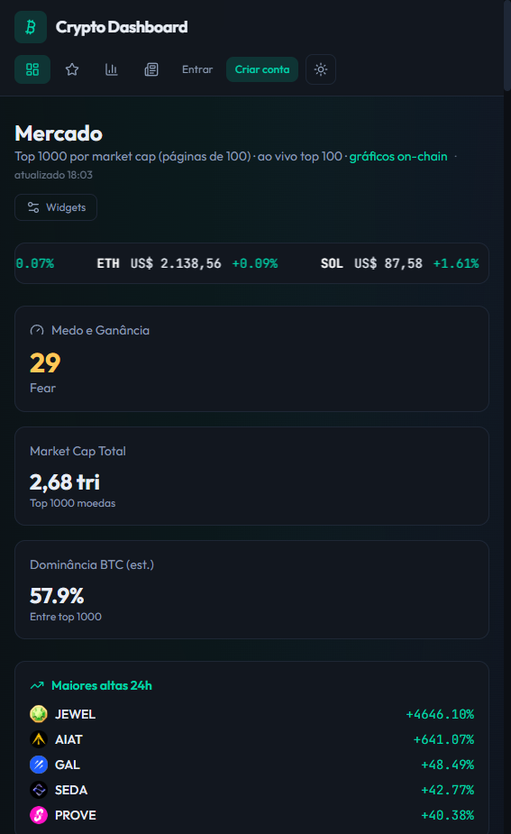
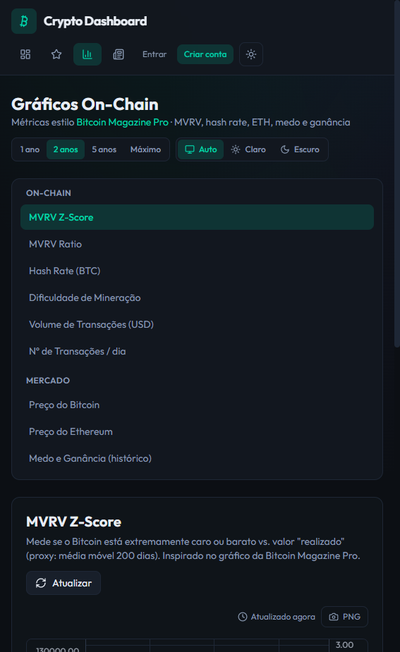
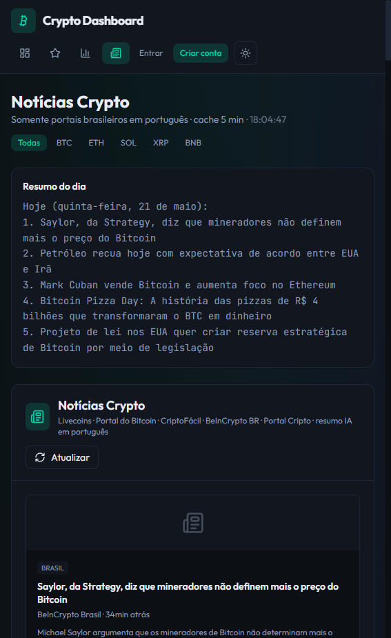
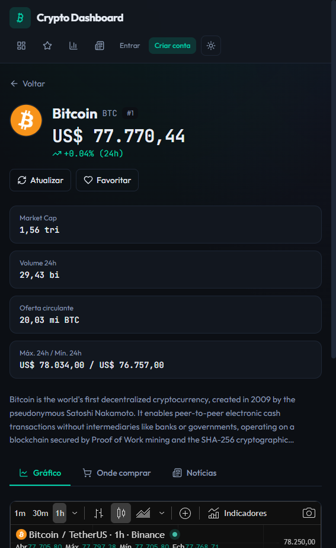

# Crypto Dashboard

Dashboard completo de criptomoedas com ranking de mercado, portfólio pessoal, gráficos on-chain e notícias em português.

## Portfólio

| Projeto | Repositório | Demo |
|---------|-------------|------|
| **Este dashboard** | [github.com/rafaelcostr/Crypto-Dashboard](https://github.com/rafaelcostr/Crypto-Dashboard) | [crypto-dashboard-iota-peach.vercel.app](https://crypto-dashboard-iota-peach.vercel.app) |
| **WhatsApp Atendimento Bot** | [github.com/rafaelcostr/whatsapp-atendimento-bot](https://github.com/rafaelcostr/whatsapp-atendimento-bot) | Bot com menu + IA (Groq) |

## Demonstração

**Site online:** [crypto-dashboard-iota-peach.vercel.app](https://crypto-dashboard-iota-peach.vercel.app)

| Dashboard | Gráficos on-chain |
|:---:|:---:|
|  |  |

| Notícias PT-BR | Página da moeda |
|:---:|:---:|
|  |  |

> Para um GIF animado, veja [scripts/make-demo-gif.md](scripts/make-demo-gif.md) (requer ffmpeg).

---

## Tecnologias

| Camada | Stack |
|--------|--------|
| **Frontend** | React 19, TypeScript, Vite 6, Tailwind CSS 4 |
| **Gráficos** | lightweight-charts |
| **Backend** | Node.js (API serverless na Vercel) |
| **Dados** | CoinGecko, Binance (WebSocket), Blockchain.com, RSS |
| **Auth** | JWT, bcrypt, e-mail de confirmação (SMTP opcional) |

---

## Funcionalidades

### Mercado em tempo real

- Ranking **Top 1000** moedas por market cap (CoinGecko)
- Preços ao vivo via **WebSocket Binance** (top 100 pares)
- Maiores altas e quedas em 24h (top movers)
- Índice **Medo e Ganância**
- Busca global por moedas e gráficos
- Página dedicada por moeda (`/coin/:id`) com preço, onde negociar e notícias

### Portfólio

- **Criar conta** e entrar (dados salvos por usuário)
- Registrar compras por data, quantidade e preço
- Cálculo de **P&L** (lucro/prejuízo)
- Gráficos de evolução da carteira (linha por mês/dia)
- **Favoritos** separados da carteira (coração na tabela)
- Abas: Ranking · Favoritos · Portfólio na tabela principal
- Exportação **CSV / JSON**
- **Alertas** de preço (acima/abaixo e variação % em X minutos) + histórico

### Gráficos

- Catálogo de gráficos **on-chain** (MVRV, hash rate, volume, Ethereum, etc.)
- Períodos: 1 ano · 2 anos · 5 anos · máximo
- Tema claro/escuro + exportar **PNG**
- Crosshair com valores ao passar o mouse
- Layout personalizável no dashboard

### Histórico e notícias

- Histórico de alertas disparados
- Histórico de valor total do portfólio
- **Notícias em português** (RSS de vários portais)
- Resumo diário com IA (opcional)
- Filtro de notícias por moeda na página da moeda

### Conta e administração

- Cadastro com **confirmação de e-mail**
- Página de conta (senha, e-mail, perfil)
- Painel **admin** (listar/remover usuários) — só `ADMIN_EMAIL`
- Tema claro/escuro em todo o app
- **PWA** instalável no celular/desktop

---

## Como rodar

```bash
npm install
cp .env.example .env   # configure ADMIN_EMAIL, AUTH_JWT_SECRET, SMTP (opcional)
npm run dev
```

Abra http://localhost:5173

```bash
npm test          # testes
npm run build     # build de produção
```

---

## Deploy (Vercel + GitHub)

1. Suba o código para o GitHub (`git push`)
2. Importe o repositório na [Vercel](https://vercel.com)
3. Configure as variáveis de ambiente:

| Variável | Obrigatório | Descrição |
|----------|-------------|-----------|
| `AUTH_JWT_SECRET` | Sim | Chave longa (32+ caracteres) |
| `APP_URL` | Sim | URL do site (ex.: `https://seu-app.vercel.app`) |
| `ADMIN_EMAIL` | Sim | E-mail do administrador |
| `COINGECKO_API_KEY` | Recomendado | Chave demo grátis (evita erro 403) |
| `SMTP_*` | Opcional | Envio de e-mail de confirmação |
| `OPENAI_API_KEY` | Opcional | Resumo de notícias com IA |

---

## Estrutura do código

Projeto organizado em **módulos por feature** (fácil manutenção):

```
src/
  app/           Rotas
  shared/        Tipos, utils, tema, layout
  features/
    auth/        Login e conta
    markets/     Ranking e favoritos
    charts/      Gráficos on-chain
    portfolio/   Carteira e alertas
    news/        Notícias
    coin/        Página da moeda
    admin/       Painel admin
api/             APIs serverless (Vercel)
```

Detalhes: [docs/ARCHITECTURE.md](docs/ARCHITECTURE.md)

---

## Aviso

Projeto educacional e de portfólio — **não constitui aconselhamento financeiro**.
